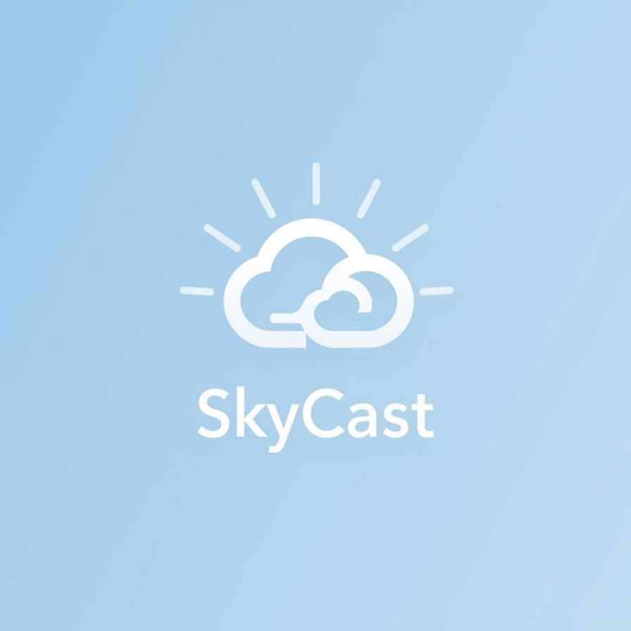
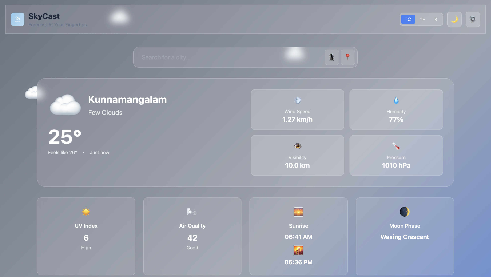
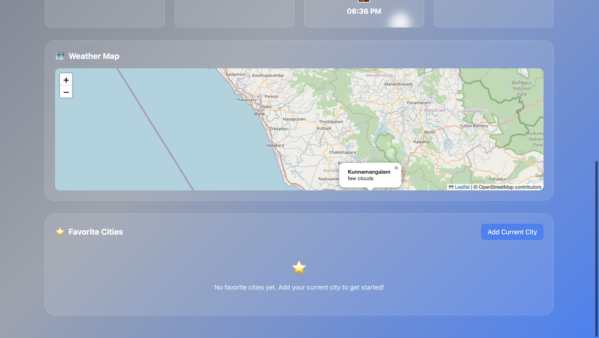

# 🌤️ SkyCast - Forecast At Your Fingertips.

SkyCast is a modern, feature-rich weather application that provides real-time updates and detailed forecasts with a sleek, 
**glassmorphism** design. Whether you're planning your day or tracking local weather patterns, SkyCast delivers high-accuracy 
data through a clean and intuitive interface.

[**Live Demo**](https://lezinsaajid.github.io/SkyCast/)



## ✨ Features

- 🌡️ **Real-Time Weather Updates**: Get instant access to temperature, weather descriptions, and "feels like" data.
- 💨 **Comprehensive Details**: Track wind speed, humidity, visibility, and atmospheric pressure.
- ☀️ **Environmental Insights**: Includes UV Index and Air Quality monitoring.
- 🌙 **Astronomical Data**: View precise Sunrise/Sunset times and current Moon Phases.
- 📊 **24-Hour Forecast**: Dynamic charts visualizing temperature trends throughout the day.
- 📅 **7-Day Forecast**: Long-term weather planning at a glance.
- 🗺️ **Interactive Weather Map**: Explore local weather conditions on an integrated map.
- ⭐ **Favorite Cities**: Save your most-visited locations for quick access using local storage.
- 🎙️ **Voice Search**: Search for any city using your voice.
- 🌗 **Dark Mode**: Seamlessly switch between light and dark themes to suit your preference.
- 📏 **Unit Customization**: Support for Celsius (°C), Fahrenheit (°F), and Kelvin (K).
- 📱 **PWA Ready**: Works offline and can be installed as a standalone app.

## 📸 Screenshots




## 🛠️ Technologies Used

- **Frontend**: HTML5, [Tailwind CSS](https://tailwindcss.com/)
- **Logic**: Vanilla JavaScript (ES6+)
- **Charts**: [Chart.js](https://www.chartjs.org/)
- **Maps**: [Leaflet.js](https://leafletjs.com/)
- **Icons**: Emoji & Custom SVG components
- **Optimization**: Glassmorphism UI, Responsive Design, PWA architecture

## 🚀 Getting Started

To run SkyCast locally:

1.  **Clone the Repository**:
    ```bash
    git clone https://github.com/lezinsaajid/SkyCast.git
    cd SkyCast
    ```
2.  **Open in Browser**:
    Simply open the `index.html` file in any modern web browser or use a local development server like **Live Server**.

---
*Created with ❤️ by Lezin Sajid*
